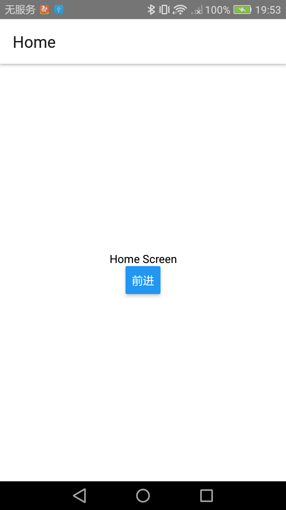
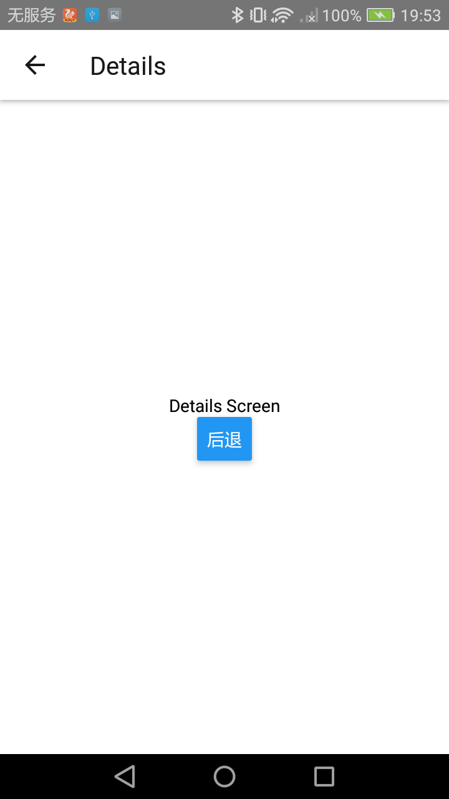
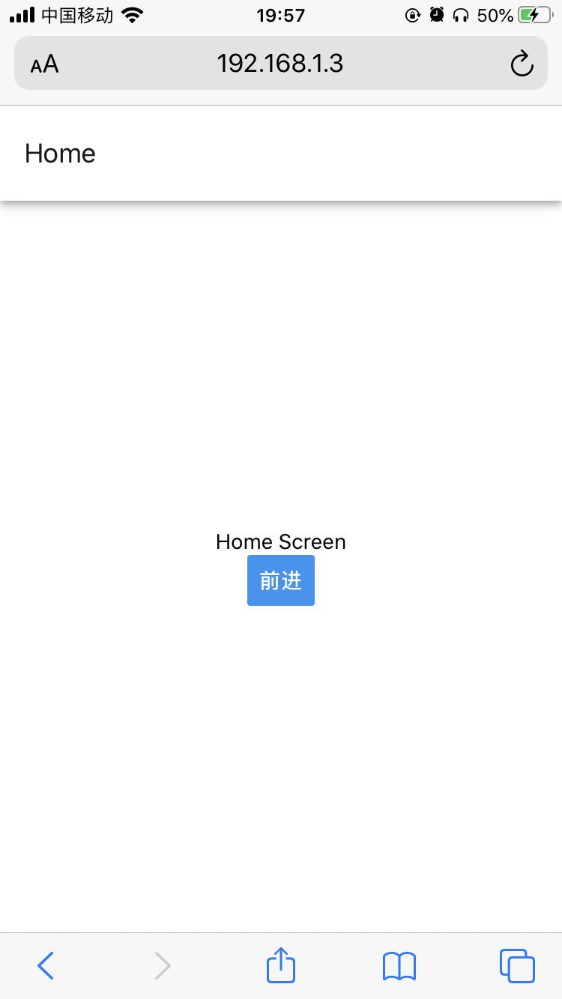
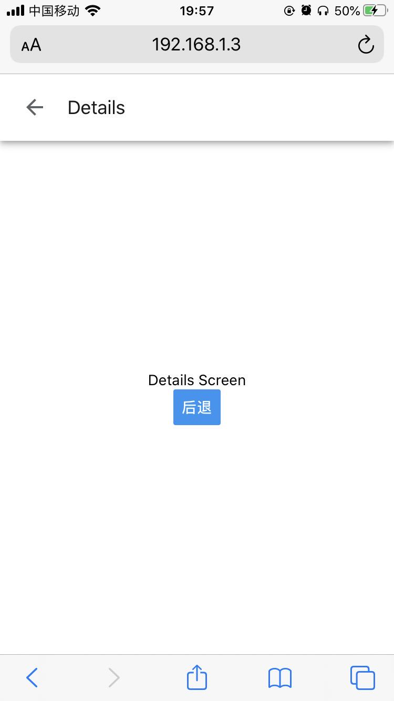
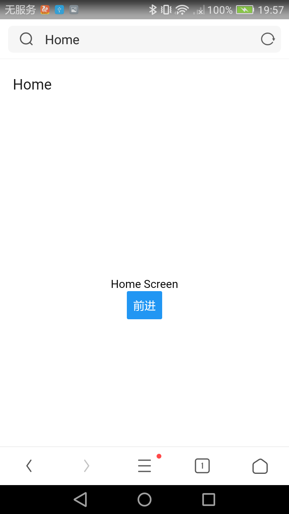
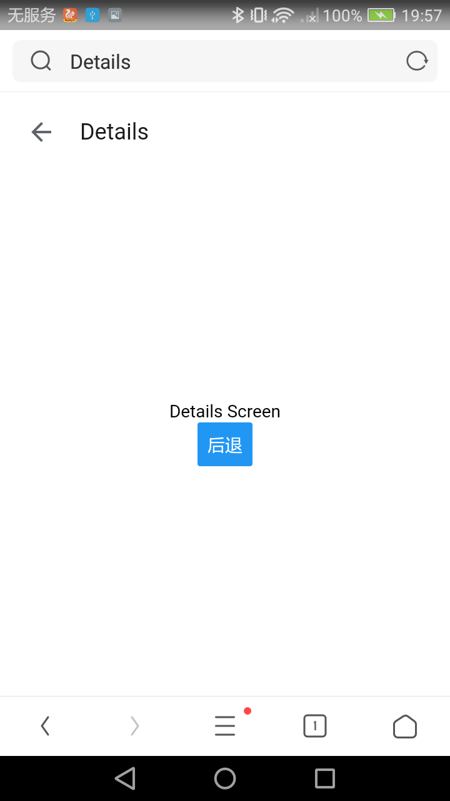

# LeleMarket2.0

刚开始学习 ReactNative 的时候，断断续续写了 LeleMarket1.0 项目，不得不承认那时候开始接触 ReactNative 写得不好，也就是当作练手吧。后来也因为各种原因没有继续去维护下去产，算是搁置了很久。最近有个想法，毕竟使用 ReactNative 也这么久了，大大小小各种需求功能也都写过，ReactNative 相关的技术也尝试了非常之多，想到曾经的 LeleMarket 项目还没有完成，觉得是个遗憾。现在是个重新开始的机会，就从 LeleMarket2.0 项目中开始，正好将自己过往所学习到的技术回顾下，作一次 ReactNative 技术栈的大整合。

## react-native-community/cli

react-native 命令行工具是越发强大了，基本上任何 RN 项目也都离不开命令行工具支持，详细学习、使用 cli 工具还是很必要的，[官方文档](https://github.com/react-native-community/cli) 了解下。

## typescript

Typescript 是一直我念念不忘的技术，无奈工作当中没有机会使用，不管什么现在一定得去尝试下，是时候去拥抱 Typescript 了。

**typescript 语法的学习**

相关文档： [https://www.tslang.cn/docs/handbook/basic-types.html](https://www.tslang.cn/docs/handbook/basic-types.html)

**全局变量的使用 window、global**

**关于 RN 项目集成 typescript**

- 旧的项目集成，参考 [https://reactnative.cn/docs/typescrip](https://reactnative.cn/docs/typescript)

- 新的项目集成，参考 [https://github.com/react-native-community/react-native-template-typescript](https://github.com/react-native-community/react-native-template-typescript)

## ReactNative 与 Web，实现三端融合

用 ReactNative 来写 Web 应用，告诉你这不是梦想，某种程度上而言， `Learn once,write anywhere`的思想在 Web 平台的确实现了。社区很早就推出`react-native-web`从而支持使用`react-native`来编写`web`应用，而且更新迭代也是非常快的，也是时候加入个这个队伍了。

[react-native-web github 官方地址](https://github.com/necolas/react-native-web)

[react-native-web 官方文档支持](https://necolas.github.io/react-native-web/docs/)，里面大致讲了集成的步骤，可以作参考。

## Webpack

关于 Web 应用打包，不容置疑 webpack 是首选，因此还得去学习使用 webpack。
[文档支持](https://www.webpackjs.com/concepts/)

**module**
ts-loader、babel-loader、url-loader、file-loader、css-loader 等的使用

**plugins**
html-webpack-plugin、clean-webpack-plugin、copy-webpack-plugin、webpack.HotModuleReplacementPlugin 等的使用

**devServer 的配置**

**dll 提升构建速度**

**optimization 性能优化**

**path、publicPath、contentBase 的区分**

## Android、iOS 和 Web 三端 Router 的支持

react-navigation 果然是大佬，除了提供 Andorid、iOS 双平台支持，人家还悄悄支持了 Web，不过现在只是 v4 版本能支持，v5 版本还在实验中，查阅了文档 v5 总体感觉上越发的像 react-router 的写法了，很是期待 v5 在 web 上的支持。

v5 版本 web 敬请期待声明 [https://reactnavigation.org/docs/web-support](https://reactnavigation.org/docs/web-support)

v4 版本 Web 支持介绍 [https://reactnavigation.org/docs/4.x/web-support](https://reactnavigation.org/docs/4.x/web-support)

## Android、iOS 和 Web 三端环境（development、staging、production）和环境变量的统一管理

Android 和 iOS 使用 react-native-config 实现，原理是在编译时期注入全局变量;
Web 使用 dotenv-webpack 实现，原理是基于 Webpack 的 DefinePlugin 插件实现的

# 目前成果

    
    

Andriod Native

    
    

iOS Native

    
    

Andriod Web

现在只是简单的一个记录，后续会完善相关文档。
[Demo](https://github.com/TryImpossible/LeleMarket-RN)，希望对你有帮助！☺️☺️☺️
